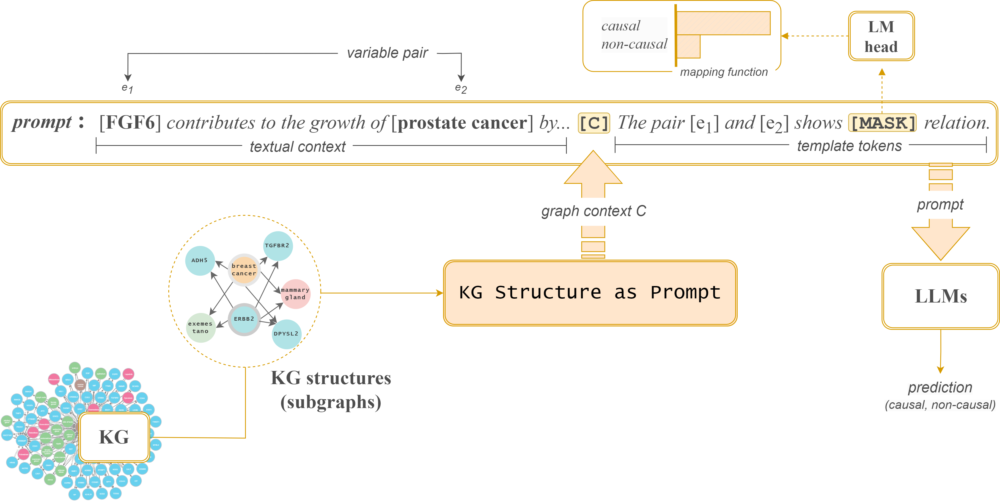

# Supplementary materials for CarCKGBuilder project: 
### CarCKGBuilder: A Novel Carbon-Assessed Crop Knowledge Graph Construction in Agricultural Domain for Carbon Effects Analytics

including the [datasets](datasets/), [codes](source-code/), and an [appendix](other-materials/Appendix.pdf) containing the hyperparameters settings and other technical details.

#### Requirements
```pip install -r requirements.txt```

#### Training
Conventional fine-tuning: `bash run_conv.sh`

(complete readme and code to-be-added)


